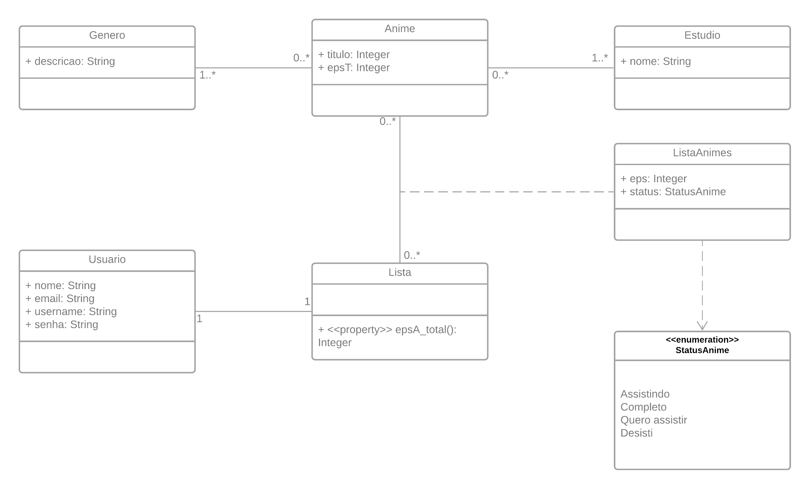

# animeList

## Descrição

O sistema possui o objetivo de facilitar a visualização, controle e organização de uma lista de animes. O usuário administrador poderá cadastrar, editar e excluir os animes, gêneros e estúdios. E o usuário comum poderá adicionar e excluir os animes disponíveis a sua lista de animes. 

Nesse sistema, cada lista será criada no momento da adição do primeiro anime na respectiva lista do usuário autenticado, dessa forma, um usuário possuirá apenas uma lista e dentro dessa lista que será adicionado os animes.

## Diagrama de Classes

### Deploy

> https://anime-list-devweb2.herokuapp.com/api/

### Django Admin

> https://anime-list-devweb2.herokuapp.com/api/admin/

### Endpoints

#### generos: 
> https://anime-list-devweb2.herokuapp.com/api/generos/

#### estudios: 
> https://anime-list-devweb2.herokuapp.com/api/estudios/

#### animes: 
> https://anime-list-devweb2.herokuapp.com/api/animes/

#### lista: 
> https://anime-list-devweb2.herokuapp.com/api/lista/

### Swagger
> https://anime-list-devweb2.herokuapp.com/api/swagger/

#### Usuários cadastrados
- Administradores
    - Login (superuser): admin   
      Senha: admin
    - Login: admin1   
      Senha: lista123
- Usuários (comum)
    - Login: usuario1   
      Senha: lista123     